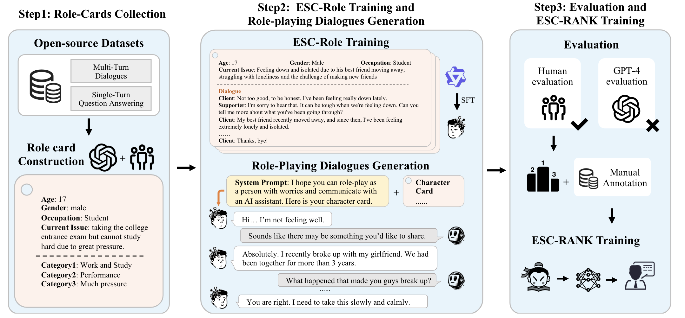
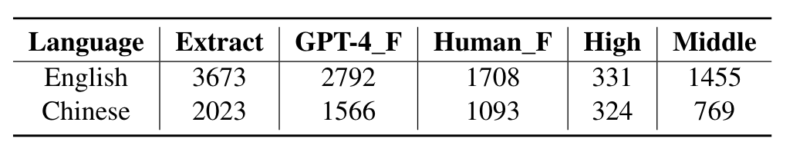
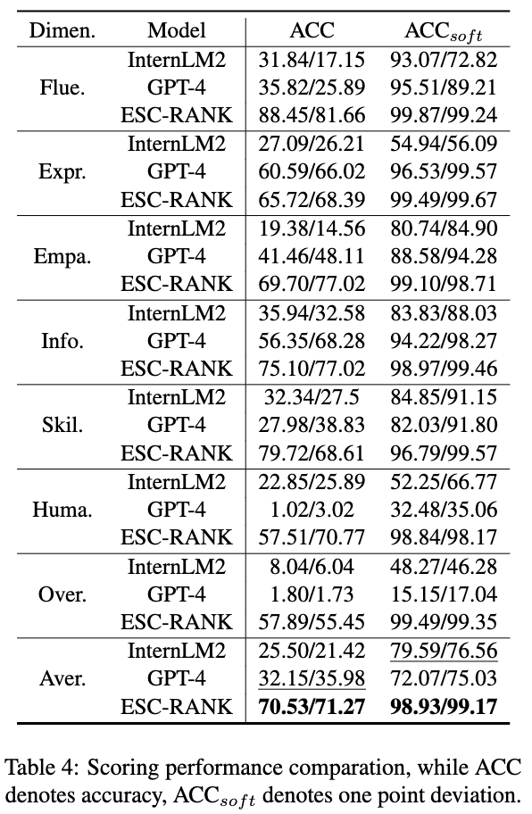
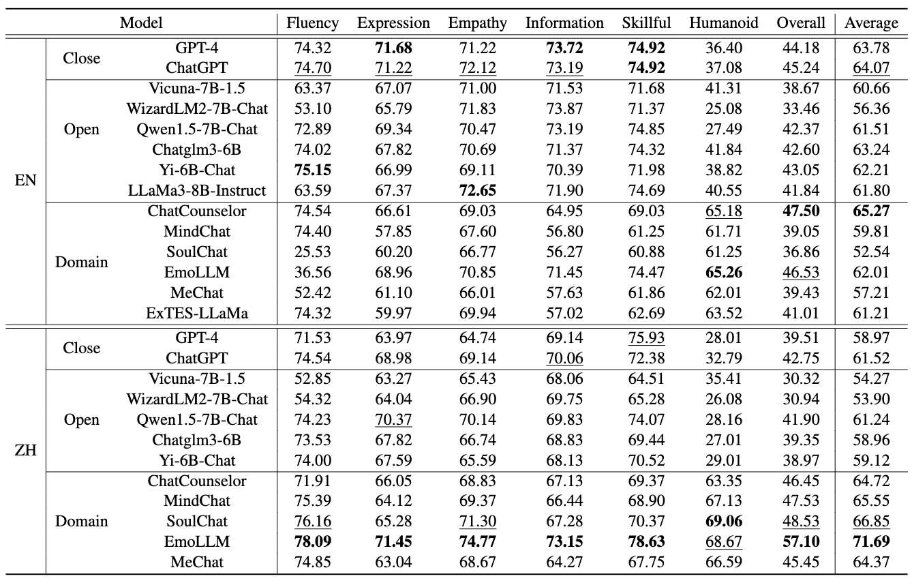

# ESC-Eval
This is the official repository of ESC-Eval, which includes the datasets and models used in the paper. The paper proposes a method for evaluating ESC models using a role-playing model, and the specific process is illustrated in the following Figure. Our paper is coming soon.

### TODO
- [ ] Middle quality character card upload

## Overview
- ./data: role_cards data use in the paper
- ./ESC-Role: our trained role playing agents which performace better than GPT4 in role-palying of a trouble person.
- ./ESC-RANK: our trained scorer for scoring dialogues data according to 7 well-designed dimensions.
<!-- - ./ESC-Role:  -->

## Usage
1. Download ESC-Role and replace the folder of './ESC-Role'
2. Change your LLM-based ESC-model to the format of below (we alse list examples of llama3 and Qwen1.5 in evaluate.py) :
<html>
    <head>

        class YourModel():
            def __init__(self):
                self.tokenizer = AutoTokenizer.from_pretrained("model_dir")
                self.model = AutoModelForCausalLM.from_pretrained("model_dir",torch_dtype="auto"device_map="auto").eval()
            def __call__(self, message,temperature=0.05) -> str:
                reponse=self.model.chat(message)
                return response

</head>
</html>
3. run evaluate.py to get multi-turn dialogue datas

4. Download ESC-RANK to folder ESC-RANK
5. run score.py using ESC-RANK on your evaluating data.

## User Cards

**Statics**

## ESC-Role
ESC-Role is a specific role-playing models for ESC evaluation, which could be download form : https://huggingface.co/haidequanbu/ESC-Role

## ESC-RANK
ESC-RANK is our training scoring for ESC evaluation, which could be download form : 
https://huggingface.co/haidequanbu/ESC-RANK

**Scoring performace**

## Leaderboard
**Human Evaluation**

## Cite
Our paper is coming soon.